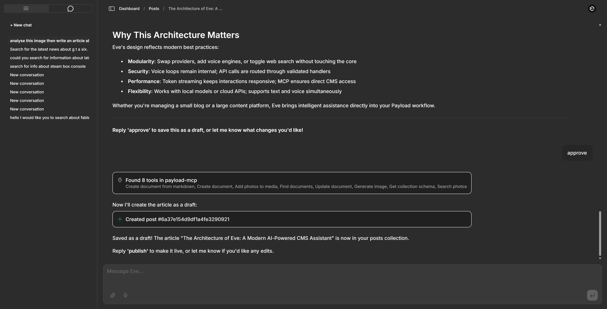
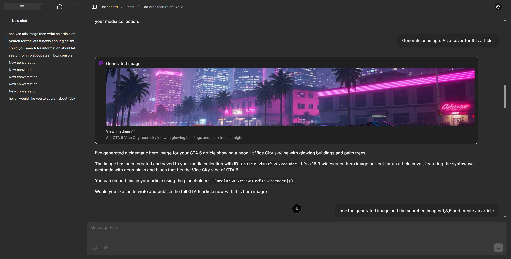
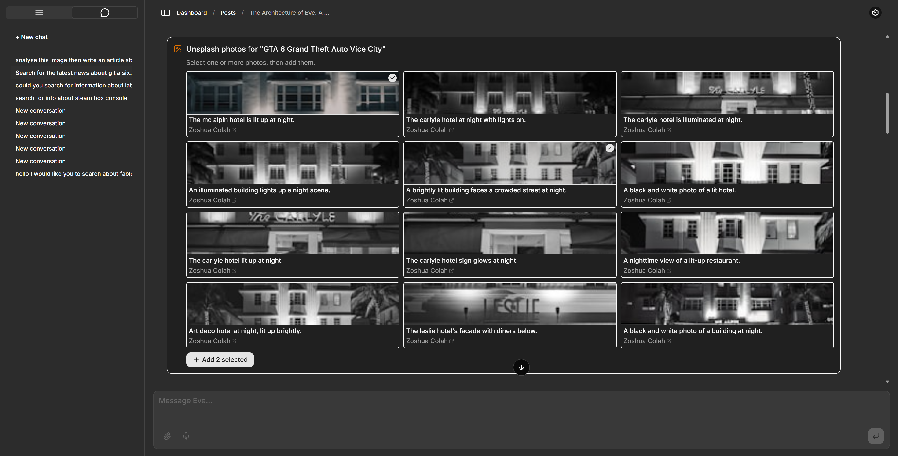
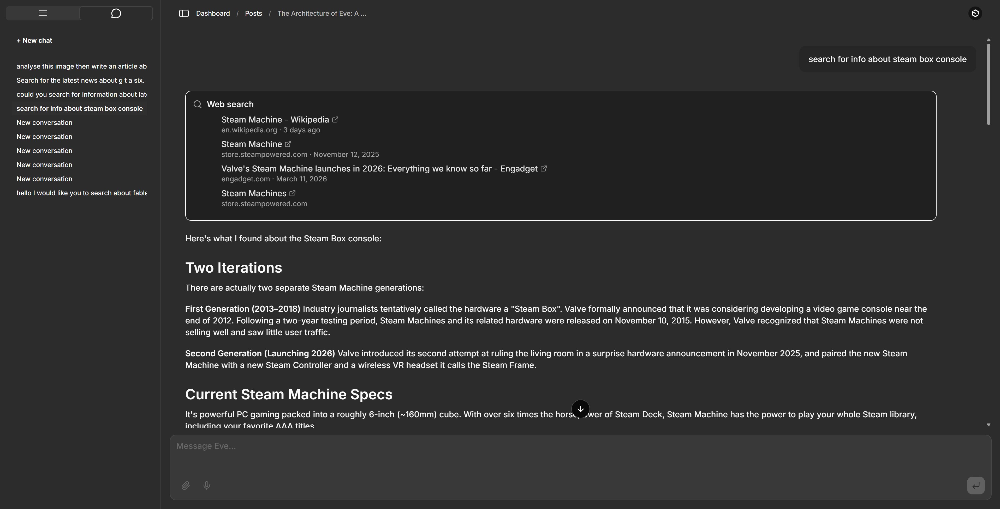
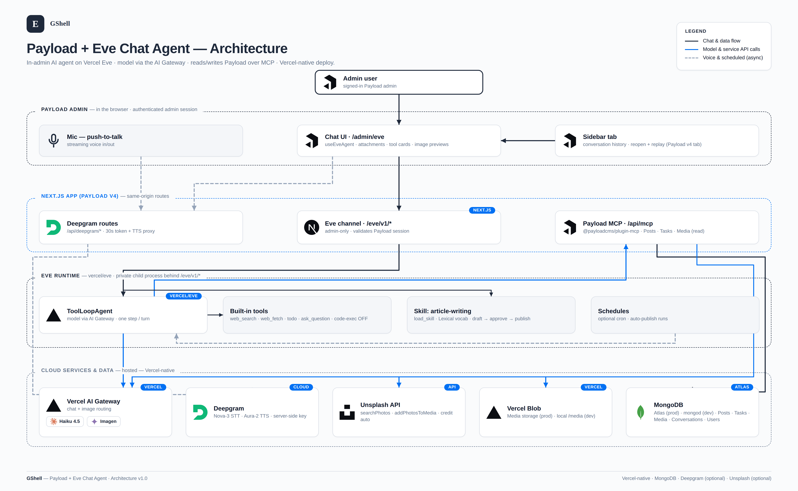
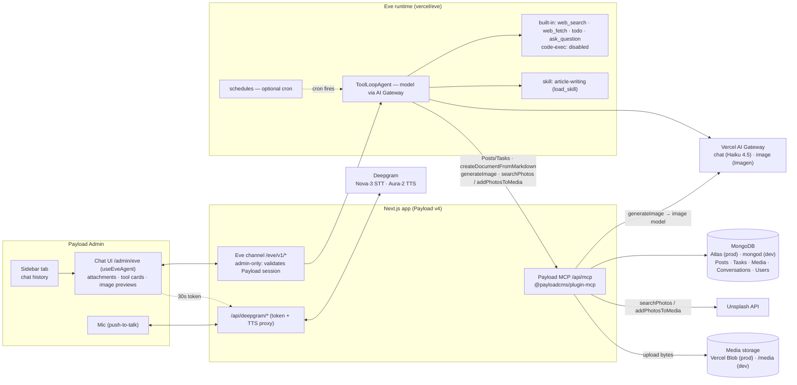

# Payload + Eve Chat Agent

A working example (and starter template) of an AI chat agent built inside Payload CMS. The agent
("Eve") lives at `/admin/eve`, reads and writes Payload collections over MCP, and is built on the
**Vercel Eve framework** (`vercel/eve`). The model is routed through the **Vercel AI Gateway**
(`anthropic/claude-haiku-4.5` by default — chosen so Eve's **native** built-in tools like
`web_search` work out of the box and tool calling for MCP is rock-solid). The project is
**Vercel-native** — every capability uses a hosted service (AI Gateway for the model, Deepgram for
voice, Eve's built-in web search) so it deploys to Vercel with no Docker/self-hosted dependencies.



## Features

- **In-admin chat** at `/admin/eve` — streaming replies, durable sessions, and a native **Payload v4
  sidebar tab** that holds your conversation history (reopen + history replay) so the chat itself
  gets the full content area. Admin-only (authenticated via the Payload session).
- **Content tools over MCP** — Eve reads and writes **Posts** and **Tasks** through Payload's MCP
  server (`/api/mcp`) and can **read Media**. Users and Conversations are fully locked out of MCP;
  Media is read-only there (image *writes* go through the image-generation tool, below).
- **Write articles (draft → approve → publish)** — ask Eve to write a post and it drafts it
  **inline** as Markdown; you approve in chat (just say "approve") and it creates the post via
  `createDocumentFromMarkdown` (Markdown → Lexical), then flips it to *published* on request. A
  load-on-demand **`article-writing` skill** teaches the full Lexical vocabulary (headings, lists,
  checklists, blockquotes, horizontal rules, strikethrough, code, links) and the image placeholder.
- **Image generation** — the `generateImage` MCP tool calls a **Vercel AI Gateway image model**
  (default `imagen-4.0-fast`, ~$0.02/image), saves the result to the **Media** collection, and
  returns its id so Eve can embed it in an article as a hero/inline image — ``
  converts to a real Lexical upload node. Override with `EVE_IMAGE_MODEL`.

  

- **Real photos from [Unsplash](https://unsplash.com/developers)** — the `searchPhotos` MCP tool
  returns a thumbnail grid of real photographs; you multi-select photos in the grid and click "Add
  selected", and `addPhotosToMedia` downloads them into Media (in one batch) with photographer
  credit. Eve can embed them in an article via `` with a mandatory
  `_Photo by [Name](url) on Unsplash_` caption. Requires `UNSPLASH_ACCESS_KEY` (free; 50 req/hr on
  demo tier). Attribution and the ToS download trigger are handled automatically.

  

- **Media storage that fits the deploy** — uploads (including generated/Unsplash images) go to
  **[Vercel Blob](https://vercel.com/docs/vercel-blob)** in production (auto-detected via
  `BLOB_READ_WRITE_TOKEN`) and to the local `/media` directory in dev. No code branch — the storage
  adapter disables itself when the token is absent. See [Media storage](#media-storage).
- **Attach files to chat** — drop **images or PDFs** into the composer and Eve reads them
  (multimodal). Attached files go straight to the model inline; they are **not** stored in Payload.
  The attachment chips clear the moment you send.
- **Rich tool cards** — every tool result renders as real UI — clickable web-search links,
  "Created post → admin link", generated-image previews, to-do checklists, discovered-tool
  summaries — **never raw JSON**. A persistent "Eve is working…" indicator covers the silent gaps
  while the agent calls tools, so a long turn never looks frozen.
- **Web search + read-URL** — Eve's provider-native `web_search` (clickable result links) and the
  built-in `web_fetch` (fetch any URL as Markdown), both through the AI Gateway. No SearXNG, no
  extra key. A client-side **stall watchdog** aborts a turn that goes silent for 60 s, so a stalled
  provider stream (a known gateway risk for server-side tools) can't hang the chat indefinitely.

  

- **Hands-free voice** — streaming speech-to-text and text-to-speech via
  **[Deepgram](https://deepgram.com)** (Nova-3 STT
  + Aura-2 TTS), push-to-talk from the mic button (appears when `DEEPGRAM_API_KEY` is set). The key
  always stays server-side: **STT** uses a short-lived token from `/api/deepgram/token` (browser
  opens the Deepgram WS directly); **TTS** is proxied through `/api/deepgram/speak` (Deepgram's
  grant tokens are ASR-scoped only, so Aura TTS can't use them). Use a **Member-role key with
  default scopes** — a lower role fails STT (`403 Insufficient permissions`), and an ASR-only-scoped
  key makes TTS silent.
- **Code-exec disabled by design** — Eve's default sandbox tools (`bash`/`read_file`/`write_file`/
  `glob`/`grep`) are turned off; the agent operates only on Payload data over MCP.

> The previous **Vercel AI SDK** implementation (with provider-switching across Claude/GPT/Ollama)
> is preserved on the **`ai-sdk` branch**.

## Architecture





The browser talks only to same-origin Next.js routes; the **Eve runtime** is a private child
process behind `/eve/v1/*`. All content lives in Payload (MongoDB); chat-attached files go inline to
the model and are never persisted.

## Requirements

Targets **Payload v4** (pinned to `canary`); requires **Node 24.15+** and **TypeScript 6+**. The
stable Payload `3.85.1` version is preserved on the **`v3`** branch.

## Quick start (local)

1. Clone the repo and `cd` into it.
2. `cp .env.example .env.local` (gitignored) and fill in:
   - `DATABASE_URL` — a local mongod (`mongodb://127.0.0.1/payload-eve-chat`) or a MongoDB Atlas
     SRV string. (Atlas has a free tier; see [Deploying to Vercel](#deploying-to-vercel).)
   - `PAYLOAD_SECRET` — any long random string.
   - **AI Gateway auth** — run `vercel link` then `vercel env pull .env.local` to fetch a
     `VERCEL_OIDC_TOKEN` (or set `AI_GATEWAY_API_KEY`). See [Model & AI Gateway](#model--ai-gateway).
   - `DEEPGRAM_API_KEY` — optional, enables voice. New Deepgram accounts get **$200 free credit**
     (no credit card): sign up at <https://console.deepgram.com/signup>, create a key, paste it in.
   - `UNSPLASH_ACCESS_KEY` — optional, enables real-photo search via Unsplash. Create a free app at
     <https://unsplash.com/oauth/applications> and copy the **Access Key** (Client-ID public auth —
     no secret needed). Demo tier allows **50 requests/hour**. When unset, the `searchPhotos` and
     `addPhotosToMedia` tools are simply not offered. Attribution (photographer credit stored on
     Media and included in the article) and the Unsplash ToS download trigger are handled
     automatically.
3. `pnpm install && pnpm devsafe` — installs deps and starts the dev server. `devsafe` clears the
   `.next` cache to avoid a Payload-v4 canary stale-RSC-cache issue; plain `pnpm dev` can error on
   stale chunks.
4. Open <http://localhost:3000/admin>, create your first admin user, then open
   **AI Chat Agent (Eve)** in the sidebar (or go to `/admin/eve`) and start chatting.

You need a MongoDB instance running. Either start a local `mongod`, or point `DATABASE_URL` at a
free MongoDB Atlas cluster — no Docker required.

## How it works

### Collections

- **Users** — auth-enabled; admin-panel access.
- **Media** — an upload collection; where Eve saves generated images (`generateImage`) and Unsplash
  photos (`addPhotosToMedia`). Stored in Vercel Blob in production, local `/media` in dev (see
  [Media storage](#media-storage)).
- **Posts** / **Tasks** — the content Eve manages over MCP.
- **Conversations** — a thin per-thread index (`eveSessionId`, `continuationToken`, `streamIndex`,
  owner). Message bodies live in Eve, not Payload.

### The Eve agent

The agent is a filesystem project under `agent/`:

```
agent/
  agent.ts                   # Eve agent definition (model via AI Gateway)
  instructions.md            # system prompt (Posts/Tasks, article + image flow, web access)
  skills/
    article-writing.md       # load-on-demand: Lexical Markdown vocab + draft→publish
  tools/
    bash.ts read_file.ts write_file.ts glob.ts grep.ts   # disableTool() — code-exec off
  connections/
    payload-mcp.ts           # Eve MCP connection → /api/mcp (Posts, Tasks, Media)
  channels/
    eve.ts                   # HTTP channel; authenticates via the Payload admin session
```

Two Payload-side MCP tools live in `src/eve/` (they run in the Next/Payload process so they can call
both the AI Gateway and `payload.create`): `markdown-tool.ts` (`createDocumentFromMarkdown`) and
`generate-image-tool.ts` (`generateImage`). They're registered on the MCP plugin in
`src/payload.config.ts`.

`withEve` in `next.config.ts` mounts Eve's HTTP channel at `/eve/v1/*`. The `/admin/eve` page uses
Eve's `useEveAgent` hook to stream through that channel. The channel is **admin-only** — it
validates the Payload session via `/api/users/me`. Eve calls **Posts**/**Tasks** tools on the
Payload MCP server (`@payloadcms/plugin-mcp`) through the `payload-mcp` connection. Voice runs
entirely client-side against Deepgram, using a 30-second token minted by the Payload-auth-gated
`POST /api/deepgram/token` route (the raw `DEEPGRAM_API_KEY` never reaches the browser).

### Model & AI Gateway

```
EVE_MODEL=anthropic/claude-haiku-4.5   # default: native web_search + strong tool calling
# EVE_PROVIDER=groq                     # optional serving-provider pin (only for models like
                                        # openai/gpt-oss-120b whose creator isn't the provider)
```

The default is chosen for strong tool calling (the MCP Posts/Tasks demo depends on it) and for
supporting Eve's **provider-native** `web_search`. Cheaper swaps: `google/gemini-2.5-flash`,
`openai/gpt-4o-mini`. Avoid models weak at tool calls (`llama-3.3-70b` emits malformed tool calls
and breaks the MCP demo) and models whose serving provider doesn't support native server tools
(e.g. `openai/gpt-oss-120b` on Groq — no `web_search`). Native web search returns clickable result
links; a client-side **stall watchdog** bounds the rare case where a server-tool stream hangs (see
Features). If native search stalls often on your chosen model, switch `EVE_MODEL` to a Sonnet/Opus
Anthropic model (broader server-tool support).

Auth the gateway with `vercel link && vercel env pull .env.local` (writes `VERCEL_OIDC_TOKEN`,
which expires ~12h — re-pull when gateway calls start returning auth errors) or set a stable
`AI_GATEWAY_API_KEY`. The gateway needs a credit card on the linked Vercel team (unlocks free
credits). **Without BYOK** the gateway relays to the provider via Vercel's own integration and bills
your **Vercel AI Gateway credits** — you don't configure the provider (e.g. Groq/Anthropic)
yourself. To bill your own provider account instead, add it under **AI Gateway → Bring Your Own
Key**. (Provider web search also bills a small per-search fee on top of tokens.)

### Image generation

Eve can generate hero images for articles using the `generateImage` tool registered in
`src/eve/generate-image-tool.ts`. The tool calls the **Vercel AI Gateway image model**, saves the
result to the Payload **Media** collection, and returns a Markdown embed placeholder
(``) for use in post bodies.

**Cost:** ~$0.02 per image (default model: `google/imagen-4.0-fast-generate-001`).

**Typical flow:**
1. User asks Eve to write an illustrated article.
2. Eve calls `generateImage({ prompt: "…", alt: "…" })` → receives `{ id, url }`.
3. Eve embeds the Media id in the article Markdown: ``.
4. `createDocumentFromMarkdown` converts it to a Lexical UploadNode — a real embedded image block.

**Configuration:**
```
EVE_IMAGE_MODEL=google/imagen-4.0-fast-generate-001   # default (~$0.02/image)
# EVE_IMAGE_MODEL=xai/grok-imagine-image              # also ~$0.02/image
# EVE_IMAGE_MODEL=bytedance/seedream-4.0              # ~$0.03/image
```

Eve only calls `generateImage` when the user explicitly requests a hero image or illustrated
article — not on every post. The tool description and `article-writing` skill both gate it.

### Media storage

The **Media** collection (admin uploads, generated images, and Unsplash photos) uses the
[`@payloadcms/storage-vercel-blob`](https://payloadcms.com/docs/upload/storage-adapters) adapter,
registered in the Payload v4 top-level `storage: [...]` array in `src/payload.config.ts` (v4 runs
storage adapters via `adapter.init()`, **not** as a `plugins[]` entry):

- **Production (Vercel):** create a Blob store in the Vercel dashboard and link it to the project.
  Vercel auto-injects `BLOB_READ_WRITE_TOKEN` and uploads go to **Vercel Blob**.
- **Local dev:** leave the token unset — the adapter disables itself and Payload writes uploads to
  the gitignored `/media` directory. No `NODE_ENV` branching.

`alwaysInsertFields: true` keeps the Media schema identical across environments whether or not Blob
is active, so `payload-types.ts` doesn't drift between dev and prod.

> **Database URL:** `db.url` resolves `DATABASE_URL → MONGODB_URI → MONGODB_URL → MONGO_URL`, so the
> connection string injected by the **Vercel MongoDB Atlas** marketplace integration (commonly
> `MONGODB_URI`) is picked up automatically — see [Deploying to Vercel](#deploying-to-vercel).

### MCP authentication: dev vs production

In **development**, `/api/mcp` requires no API key (a dev-only `overrideAuth` runs as the first
admin). In **production**, set `MCP_API_KEY` to a Bearer key created in the Payload admin under
**Settings → Manage API keys**.

## The Vercel Eve framework

This project is built on **[Vercel Eve](https://eve.dev/docs)** (`vercel/eve`) — an open framework
for building agents as a **filesystem project** (everything under `agent/`). What it gives you, and
what this template uses:

- **Agent runtime** — a `ToolLoopAgent` with the model routed through the **Vercel AI Gateway**
  (`agent/agent.ts`). One step per turn; the harness drives the tool loop.
- **Built-in tools** — `web_search`, `web_fetch`, `todo`, `ask_question`, `load_skill`, plus
  sandbox code-exec (`bash`/`read_file`/`write_file`/`glob`/`grep`) that you can toggle per tool.
  See the [default harness](https://eve.dev/docs/concepts/default-harness).
- **Connections** — attach external tool servers (here, the Payload MCP server via
  `agent/connections/payload-mcp.ts`); Eve discovers their tools on demand.
- **Channels** — front the agent over HTTP (this app's `agent/channels/eve.ts`), or Slack, Discord,
  GitHub, Telegram, Twilio, Teams, Linear, etc.
- **Skills** — load-on-demand Markdown capabilities (`agent/skills/article-writing.md`).
- **Schedules** — cron-driven agent runs (`agent/schedules/*`), great for recurring content.
- **Frontend hooks** — `useEveAgent` for React (also Vue/Svelte) drives the streaming chat UI.

### Scheduled runs — auto-publish an article every morning

Eve [schedules](https://eve.dev/docs/schedules) are files under `agent/schedules/`. Each exports a
`cron` plus **exactly one** of `markdown` (a fire-and-forget prompt the agent runs and discards the
output of) or `run` (a full handler). Because this template already gives Eve the tools to research,
illustrate, and publish, a daily article is just a prompt on a cron:

```ts
// agent/schedules/daily-article.ts
import { defineSchedule } from 'eve/schedules'

export default defineSchedule({
  cron: '0 8 * * *', // every day at 08:00 (server time)
  markdown: [
    'Write and publish a short blog post for today.',
    'Use web_search to pick a fresh, relevant topic, draft it with the article-writing skill,',
    'add a hero image with generateImage (or a real photo via searchPhotos), then create it with',
    'createDocumentFromMarkdown and set status to "published".',
  ].join(' '),
})
```

`eve info` lists discovered schedules; `withEve` deploys them so the cron fires on Vercel. Caveats:
a scheduled run **bills AI Gateway credits** (and image credits if it generates one), it runs as the
agent with no interactive approval, and in production it needs the MCP connection authorized
(`MCP_API_KEY`). Start with a low frequency and a draft-only prompt (`status: "draft"`) while you
tune it. Full reference: <https://eve.dev/docs/schedules>.

## Deploying to Vercel

The app is Vercel-native; `withEve` deploys the Eve runtime as a private service automatically.

1. **MongoDB** — either add the **MongoDB Atlas** integration from the Vercel Marketplace (Project →
   Storage), which provisions a cluster and injects the connection string for you (commonly as
   `MONGODB_URI` — the config reads it automatically), **or** create a free Atlas cluster manually,
   allow Vercel's network (or `0.0.0.0/0` for a quick start), and set `DATABASE_URL` to the
   `mongodb+srv://…` string yourself.
2. **Vercel Blob** — create a Blob store (Project → Storage → Blob) and connect it. Vercel injects
   `BLOB_READ_WRITE_TOKEN`; Media uploads then go to Blob automatically (see
   [Media storage](#media-storage)).
3. **Link the project** — `vercel link` (this repo). Eve's model routing already uses the AI
   Gateway, so no provider keys are needed in code.
4. **Set environment variables** (Vercel dashboard → Project → Settings → Environment Variables):
   - `MONGODB_URI` (from the Atlas integration) **or** `DATABASE_URL` = the `mongodb+srv://…` string
   - `BLOB_READ_WRITE_TOKEN` = set automatically by the linked Blob store (no manual entry needed)
   - `PAYLOAD_SECRET` = a long random string
   - `MCP_API_KEY` = a production MCP key (see above)
   - `DEEPGRAM_API_KEY` = your [Deepgram](https://deepgram.com) key (for voice, optional)
   - `UNSPLASH_ACCESS_KEY` = your [Unsplash](https://unsplash.com/developers) Access Key (real
     photos, optional)
   - AI Gateway auth is provided by Vercel OIDC automatically in production (or set
     `AI_GATEWAY_API_KEY`).
   - `PAYLOAD_INTERNAL_URL` — **not required.** The Eve runtime validates the admin session by
     calling the app's `/api/users/me`, and auto-detects the deployment URL on Vercel
     (`VERCEL_PROJECT_PRODUCTION_URL` / `VERCEL_URL`). Only set this if the auto-detected URL
     isn't reachable from the Eve service (e.g. a custom internal hostname, or **Vercel
     Deployment Protection** is on — exempt the production domain or set this to a reachable
     URL). If a chat turn returns *"Authorization is required for this route,"* this is why.
5. **Deploy** — `vercel deploy` (or push to a connected Git branch). `withEve` runs `eve build`
   and serves the agent at the private `/_eve_internal/eve` service; `/eve/v1/*` is rewritten to it
   same-origin.

> A future Vercel Sandbox code-exec tool would re-enable the sandbox tools with a `vercel()`
> backend in `agent/sandbox/sandbox.ts` — see `docs/superpowers/notes/eve-tools-findings.md`.

## How to test this project

All commands are safe to run locally. Note: the **end-to-end agent test calls the live model
through the AI Gateway and bills credits** — run it deliberately, not in a loop.

- **Unit / integration (no credits, no network):**
  ```bash
  pnpm test:int        # Vitest — collections, routes, helpers, the Deepgram token route
  pnpm exec tsc --noEmit
  node_modules/.bin/eve info   # compiles the agent graph; should report 0 diagnostics
  ```
- **End-to-end (Playwright):**
  ```bash
  pnpm devsafe         # start the app (the Eve runtime is a child process; keep it up)
  pnpm test:e2e        # admin.e2e.spec.ts (no model calls) + eve-chat.e2e.spec.ts (LIVE model)
  ```
  `eve-chat.e2e.spec.ts` seeds its own admin, asks Eve to create a Task, and asserts it persisted —
  this one spends AI Gateway credits. It needs `VERCEL_OIDC_TOKEN`/`AI_GATEWAY_API_KEY` set and a
  reachable MongoDB. Playwright runs serially (`workers: 1`) because specs share one admin user.
- **Voice (manual, needs a mic + `DEEPGRAM_API_KEY`):** open `/admin/eve`, hold the mic button (or
  the keyboard shortcut) to talk — push-to-talk — and confirm Eve transcribes it, replies, and
  speaks the reply aloud. (Uses Deepgram credit, not the AI Gateway.)
- **Image generation & illustrated articles (manual, bills AI Gateway image credits):** ask Eve to
  attach a hero image / write an illustrated article and confirm the generated image saves to Media
  and embeds in the post. Also try attaching an image or PDF in the composer and asking about it.

## Questions

For questions about Payload itself, see the [Payload Discord](https://discord.com/invite/payload).
For anything specific to this project — bugs, ideas, setup help —
[open an issue](https://github.com/elghaied/payload-eve-chat/issues).
