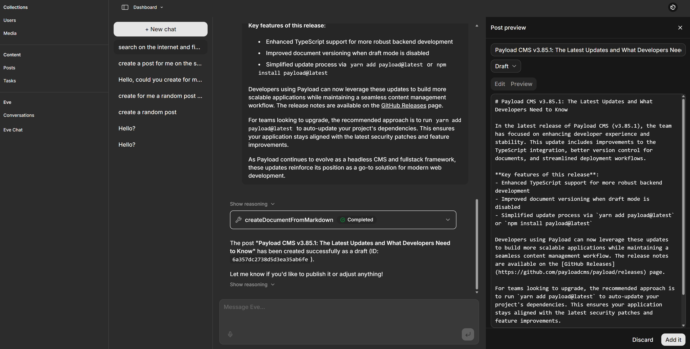

# Payload + Eve Chat Agent

A working example of an AI chat agent built inside Payload CMS. The agent ("Eve") lives at
`/admin/eve`, reads and writes Payload collections over MCP, and is built on the **Vercel Eve
framework** (`vercel/eve`). The model is routed through the **Vercel AI Gateway**
(`openai/gpt-oss-120b`, served by Groq, by default). The project is **Vercel-native** — every
capability uses a hosted service (AI Gateway for the model, Deepgram for voice, Eve's built-in web
search) so it deploys to Vercel with no Docker/self-hosted dependencies.



## Features

- **In-admin chat** at `/admin/eve` — streaming replies, durable sessions, a thread sidebar with
  reopen + history replay. Admin-only (authenticated via the Payload session).
- **Content tools over MCP** — Eve reads and writes **Posts** and **Tasks** entirely through
  Payload's MCP server (`/api/mcp`). Users/Media/Conversations are locked out of MCP.
- **Post preview (approve-before-create)** — when you ask Eve to write a post, it calls
  `propose_post` and shows an **editable** preview panel; the post is only created via
  `createDocumentFromMarkdown` after you review/edit and approve.
- **Web search + read-URL** — Eve's built-in `web_search` (Vercel AI Gateway) and `web_fetch`
  (fetch any URL as Markdown). No SearXNG, no extra keys.
- **Hands-free voice** — streaming speech-to-text and text-to-speech via **Deepgram** (Nova-3 STT
  + Aura-2 TTS) with end-of-utterance detection and barge-in. The mic button appears when
  `DEEPGRAM_API_KEY` is configured.
- **Code-exec disabled by design** — Eve's default sandbox tools (`bash`/`read_file`/`write_file`/
  `glob`/`grep`) are turned off; the agent operates only on Payload data over MCP.

> The previous **Vercel AI SDK** implementation (with provider-switching across Claude/GPT/Ollama)
> is preserved on the **`ai-sdk` branch**.

## Requirements

Targets **Payload v4** (pinned to `canary`); requires **Node 24.15+** and **TypeScript 6+**. The
stable Payload `3.85.1` version is preserved on the **`v3`** branch.

## Quick start (local)

1. Clone the repo and `cd` into it.
2. `cp .env.example .env.local` (gitignored) and fill in:
   - `DATABASE_URL` — a local mongod (`mongodb://127.0.0.1/payload-eve-chat`) or a MongoDB Atlas
     SRV string. (Atlas has a free tier; see [Deploying to Vercel](#deploying-to-vercel).)
   - `PAYLOAD_SECRET` — any long random string.
   - **AI Gateway auth** — run `vercel link` then `vercel env pull .env.local` to fetch a
     `VERCEL_OIDC_TOKEN` (or set `AI_GATEWAY_API_KEY`). See [Model & AI Gateway](#model--ai-gateway).
   - `DEEPGRAM_API_KEY` — optional, enables voice. New Deepgram accounts get **$200 free credit**
     (no credit card): sign up at <https://console.deepgram.com/signup>, create a key, paste it in.
3. `pnpm install && pnpm devsafe` — installs deps and starts the dev server. `devsafe` clears the
   `.next` cache to avoid a Payload-v4 canary stale-RSC-cache issue; plain `pnpm dev` can error on
   stale chunks.
4. Open <http://localhost:3000/admin>, create your first admin user, then open
   **AI Chat Agent (Eve)** in the sidebar (or go to `/admin/eve`) and start chatting.

You need a MongoDB instance running. Either start a local `mongod`, or point `DATABASE_URL` at a
free MongoDB Atlas cluster — no Docker required.

## How it works

### Collections

- **Users** — auth-enabled; admin-panel access.
- **Media** — uploads with preconfigured sizes/focal point.
- **Posts** / **Tasks** — the content Eve manages over MCP.
- **Conversations** — a thin per-thread index (`eveSessionId`, `continuationToken`, `streamIndex`,
  owner). Message bodies live in Eve, not Payload.

### The Eve agent

The agent is a filesystem project under `agent/`:

```
agent/
  agent.ts                   # Eve agent definition (model via AI Gateway)
  instructions.md            # system prompt (Posts/Tasks, post-preview, web access)
  tools/
    bash.ts read_file.ts write_file.ts glob.ts grep.ts   # disableTool() — code-exec off
    propose_post.ts          # approve-before-create post preview (HITL)
  connections/
    payload-mcp.ts           # Eve MCP connection → /api/mcp (Posts + Tasks)
  channels/
    eve.ts                   # HTTP channel; authenticates via the Payload admin session
```

`withEve` in `next.config.ts` mounts Eve's HTTP channel at `/eve/v1/*`. The `/admin/eve` page uses
Eve's `useEveAgent` hook to stream through that channel. The channel is **admin-only** — it
validates the Payload session via `/api/users/me`. Eve calls **Posts**/**Tasks** tools on the
Payload MCP server (`@payloadcms/plugin-mcp`) through the `payload-mcp` connection. Voice runs
entirely client-side against Deepgram, using a 30-second token minted by the Payload-auth-gated
`POST /api/deepgram/token` route (the raw `DEEPGRAM_API_KEY` never reaches the browser).

### Model & AI Gateway

```
EVE_MODEL=openai/gpt-oss-120b   # any AI Gateway slug whose model supports tool calling
EVE_PROVIDER=groq               # serving-provider pin (gpt-oss is served by groq/cerebras/...)
```

Auth the gateway with `vercel link && vercel env pull .env.local` (writes `VERCEL_OIDC_TOKEN`,
which expires ~12h — re-pull when gateway calls start returning auth errors) or set a stable
`AI_GATEWAY_API_KEY`. The gateway needs a credit card on the linked Vercel team (unlocks free
credits) and bills Vercel AI Gateway credits by default; to bill your own provider instead, add it
under **AI Gateway → Bring Your Own Key**. Avoid models weak at tool calls (`llama-3.3-70b` emits
malformed tool calls); `openai/gpt-oss-120b` works well.

### MCP authentication: dev vs production

In **development**, `/api/mcp` requires no API key (a dev-only `overrideAuth` runs as the first
admin). In **production**, set `MCP_API_KEY` to a Bearer key created in the Payload admin under
**Settings → Manage API keys**.

## Deploying to Vercel

The app is Vercel-native; `withEve` deploys the Eve runtime as a private service automatically.

1. **MongoDB Atlas** — create a free cluster, a database user, and allow Vercel's network (or
   `0.0.0.0/0` for a quick start). Copy the `mongodb+srv://…` connection string.
2. **Link the project** — `vercel link` (this repo). Eve's model routing already uses the AI
   Gateway, so no provider keys are needed in code.
3. **Set environment variables** (Vercel dashboard → Project → Settings → Environment Variables):
   - `DATABASE_URL` = the Atlas `mongodb+srv://…` string
   - `PAYLOAD_SECRET` = a long random string
   - `MCP_API_KEY` = a production MCP key (see above)
   - `DEEPGRAM_API_KEY` = your Deepgram key (for voice)
   - AI Gateway auth is provided by Vercel OIDC automatically in production (or set
     `AI_GATEWAY_API_KEY`).
4. **Deploy** — `vercel deploy` (or push to a connected Git branch). `withEve` runs `eve build`
   and serves the agent at the private `/_eve_internal/eve` service; `/eve/v1/*` is rewritten to it
   same-origin.

> A future Vercel Sandbox code-exec tool would re-enable the sandbox tools with a `vercel()`
> backend in `agent/sandbox/sandbox.ts` — see `docs/superpowers/notes/eve-tools-findings.md`.

## How to test this project

All commands are safe to run locally. Note: the **end-to-end agent test calls the live model
through the AI Gateway and bills credits** — run it deliberately, not in a loop.

- **Unit / integration (no credits, no network):**
  ```bash
  pnpm test:int        # Vitest — collections, routes, helpers, the Deepgram token route
  pnpm exec tsc --noEmit
  node_modules/.bin/eve info   # compiles the agent graph; should report 0 diagnostics
  ```
- **End-to-end (Playwright):**
  ```bash
  pnpm devsafe         # start the app (the Eve runtime is a child process; keep it up)
  pnpm test:e2e        # admin.e2e.spec.ts (no model calls) + eve-chat.e2e.spec.ts (LIVE model)
  ```
  `eve-chat.e2e.spec.ts` seeds its own admin, asks Eve to create a Task, and asserts it persisted —
  this one spends AI Gateway credits. It needs `VERCEL_OIDC_TOKEN`/`AI_GATEWAY_API_KEY` set and a
  reachable MongoDB. Playwright runs serially (`workers: 1`) because specs share one admin user.
- **Voice (manual, needs a mic + `DEEPGRAM_API_KEY`):** open `/admin/eve`, click the mic button,
  speak a request, and confirm Eve transcribes it, replies, and speaks the reply aloud; start
  talking while it speaks to confirm barge-in stops playback. (Uses Deepgram credit, not the AI
  Gateway.)

## Questions

For questions about Payload itself, see the [Payload Discord](https://discord.com/invite/payload).
For anything specific to this project — bugs, ideas, setup help —
[open an issue](https://github.com/elghaied/payload-eve-chat/issues).
